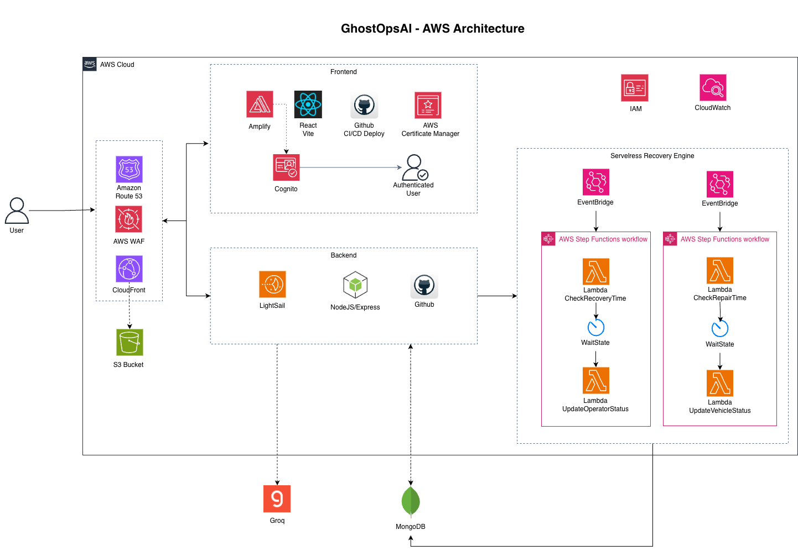

# GhostOpsAI — Frontend


AI-powered tactical operations platform for Ghost Recon Breakpoint. Manage operators, teams, vehicles, missions, and campaigns from a unified command dashboard.

**Live:** [ghostopsai.com](https://www.ghostopsai.com)

---

## Table of Contents

- [Architecture](#architecture)
- [Tech Stack](#tech-stack)
- [Features](#features)
- [Project Structure](#project-structure)
- [Routes](#routes)
- [Vehicle System](#vehicle-system)
- [Getting Started](#getting-started)
- [Deployment](#deployment)
- [Disclaimer](#disclaimer)

---

## Architecture



The platform runs entirely on AWS. DNS and WAF sit in front of CloudFront, which routes traffic to the Amplify-hosted frontend and the LightSail Express backend. Cognito handles authentication. MongoDB stores all operational data. Two independent **Serverless Recovery Engines** (Step Functions + Lambda + EventBridge) drive the infirmary recovery timer and the vehicle repair workflow. AI mission generation is powered by **Groq**.

---

## Tech Stack

| Layer | Technology |
|-------|-----------|
| Framework | React 18 + Vite |
| Styling | Tailwind CSS v4 |
| Routing | React Router DOM v7 |
| State Management | Zustand |
| Authentication | AWS Cognito via `react-oidc-context` |
| HTTP Client | Axios |
| Maps | Leaflet |
| Icons | FontAwesome 6 |
| Notifications | React Toastify |
| Build | Vite + Rollup with manual chunk splitting |

---

## Features

- **Operator Management** — create, assign, and track operator status, loadouts, injuries, and KIA
- **Team & Squad Builder** — organize operators into teams with live readiness scoring
- **Vehicle Garage** — time-based fuel simulation, wear & tear tracking, and repair workflow
- **Mission Planner** — AI-generated missions, phase tracking, and After Action Reviews
- **Campaign Engine** — province-based campaign with biome, terrain, and weather modifiers
- **Infirmary** — injury tracking with recovery timers
- **Memorial** — permanent KIA log
- **Tactical Map** — Leaflet map with operational overlays
- **AI Integration** — Groq-powered mission generation

---

## Project Structure

```
src/
├── api/                   # Axios API clients (one per resource)
│   ├── ApiClient.js       # Base instance with auth headers
│   ├── VehicleApi.js
│   ├── OperatorsApi.js
│   ├── TeamsApi.js
│   ├── MissionsApi.js
│   └── ...
├── auth/                  # PrivateRoute, AuthRedirector
├── components/
│   ├── ai/                # AI mission generator
│   ├── forms/             # Create / edit forms for all entities
│   ├── tables/            # Data tables (Roster, Garage, Infirmary…)
│   ├── mission/           # Mission phase components
│   └── ui/                # Shared primitives (button, dialog, sheet)
├── config/                # Static game data (vehicles, weapons, injuries, provinces…)
├── layout/                # MainLayout, DashboardLayout
├── pages/
│   ├── Home.jsx
│   ├── Login.jsx
│   └── UnifiedDashboard.jsx
├── zustand/               # Global stores (operators, vehicles, teams, missions…)
└── routes.jsx             # Route definitions with lazy loading
```

---

## Routes

| Path | Access | Description |
|------|--------|-------------|
| `/` | Public | Landing page |
| `/login` | Public | Sign in |
| `/dashboard` | Protected | Main command dashboard |
| `/dashboard/roster` | Protected | Operator roster |
| `/dashboard/teams` | Protected | Team management |
| `/dashboard/infirmary` | Protected | Injury tracking |
| `/dashboard/memorial` | Protected | KIA memorial |
| `/dashboard/garage` | Protected | Vehicle fleet |
| `/dashboard/newOperator` | Protected | Create operator |
| `/dashboard/editOperator` | Protected | Edit operator |
| `/dashboard/newTeam` | Protected | Create team |
| `/dashboard/editTeam` | Protected | Edit team |
| `/dashboard/newVehicle` | Protected | Add vehicle |
| `/dashboard/editVehicle` | Protected | Edit vehicle |

> All dashboard routes are **lazy loaded**. Only the landing page and login are included in the initial JS bundle, keeping first-paint fast.

---

## Vehicle System

All vehicles use a unified **time-based fuel model** — no more separate fuel/battery/timer logic.

| Field | Description |
|-------|-------------|
| `maxTime` | Total operational minutes at full fuel (max 10 min) |
| `wearRate` | % wear added per minute of use |

**Condition thresholds** (driven by `wearPercent`):

| Wear % | Condition | Deployable |
|--------|-----------|-----------|
| 0–24% | Optimal | Yes |
| 25–49% | Operational | Yes |
| 50–74% | Compromised | Yes |
| 75%+ | Critical | No — repair required |

Players input how long they want to use a vehicle (in minutes). The system calculates fuel consumed and wear added, then logs both to the backend.

---

## Getting Started

### Prerequisites

- Node.js 18+
- AWS Cognito User Pool

### Installation

```bash
git clone https://github.com/your-org/frontend-ghostops.git
cd frontend-ghostops
npm install
```

### Environment Variables

Create a `.env` file in the project root:

```env
VITE_API_URL=https://your-backend-api.com/api
VITE_COGNITO_AUTHORITY=https://cognito-idp.<region>.amazonaws.com/<user-pool-id>
VITE_COGNITO_CLIENT_ID=your_client_id
VITE_COGNITO_REDIRECT_URI=http://localhost:5173
```

### Running Locally

```bash
# Start development server
npm run dev

# Production build
npm run build

# Preview production build locally
npm run preview
```

---

## Deployment

The app is deployed via **AWS Amplify**. Pushing to `main` triggers an automatic build and deploy.

Configuration is in `amplify.yml` at the project root.

---

## Disclaimer

This project is not affiliated with Ubisoft Entertainment. Tom Clancy's Ghost Recon Breakpoint and all related marks are trademarks of Ubisoft Entertainment. GhostOpsAI is an independent, community-driven project not intended for commercial use.
